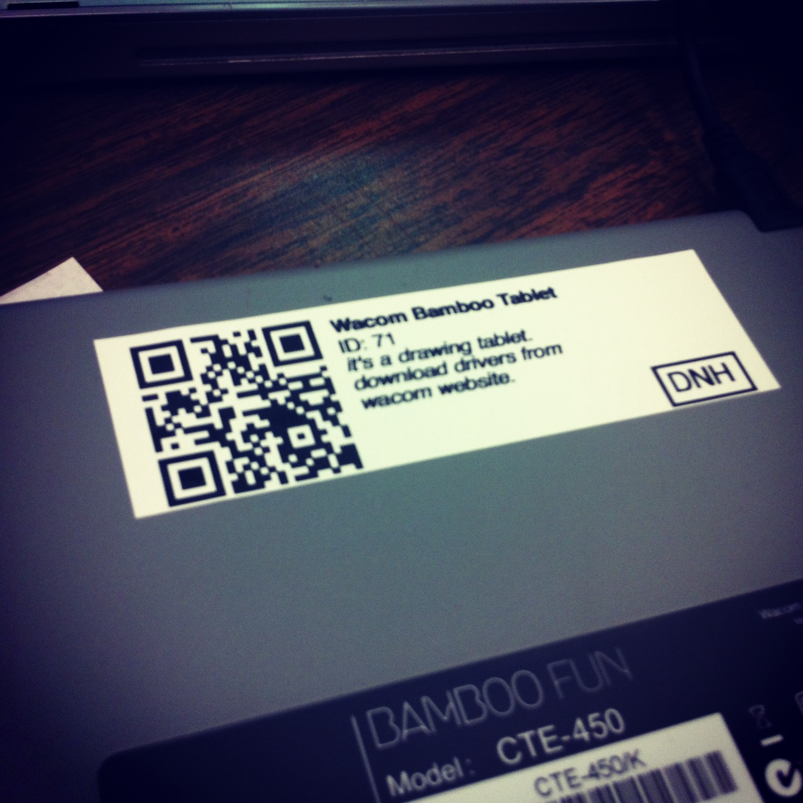

# SudoQRCode

# Goal

* Easily reusable code like an npm module that can be used when
we want to create an open-source iOS/iPad app to help with for example
the ongoing inventory system or training new members with tools or
maintenance, etc.

* Eventually rolled into SudoCare for people to train / learn / help maintain stuff and assist in membership trial periods 

* Sure, there are "freemium" and other open source QR code readers out
there but we are hackers, and we want our own. Plus this will
help people understand the APIs better.

# Style

* I'll try to keep this code as small as possible, similar
to an npm module.

* Either make gui in code or use nib files to keep this as modular as possible 

* We'll try to rely as much as possible on 
native classes by apple and avoid frameworks if possible.
I don't think this will be a big problem though.

# Reference

* Inventory System at SudoRoom - [wiki](https://sudoroom.org/wiki/Inventory) the one rare case where QR codes are useful. Please! no more jokes about QR Codes 

* AVMetadataMachineReadableCodeObject Class Reference - [apple doc](https://developer.apple.com/library/ios/documentation/AVFoundation/Reference/AVMetadataMachineReadableCodeObject_Class/#//apple_ref/doc/constant_group/Machine_Readable_Object_Types)

# Open Source

Starting this out in Objective-C but this should
eventually be moved to Swift since Apple is open sourcing that
later this year. 

